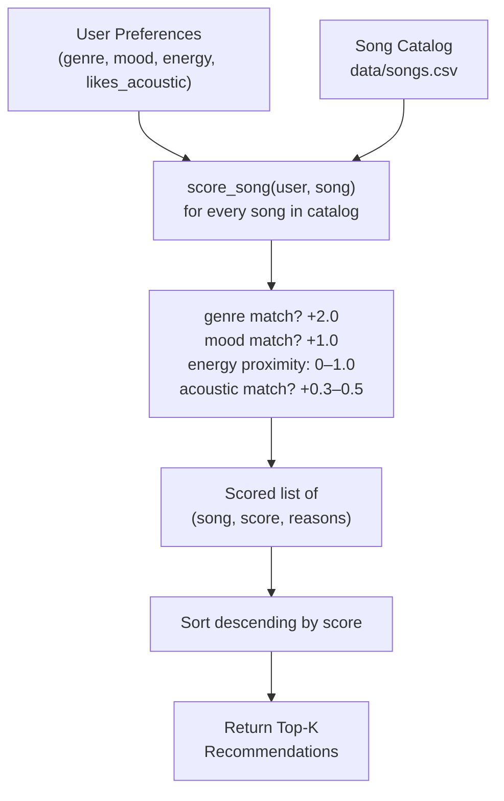

# Music Recommender Simulation

## Project Summary

This project simulates a content-based music recommendation engine in Python. Given a user's taste profile — preferred genre, mood, and energy level — the system scores every song in a CSV catalog and returns the top-ranked matches along with a plain-language explanation for each result.

The goal is to understand how real platforms like Spotify translate raw data (song attributes + listener preferences) into ranked suggestions, and to identify where simple algorithms succeed and where they introduce bias.

---

## How The System Works

### Song Features

Each `Song` object stores ten attributes read from `data/songs.csv`:

| Feature | Type | Description |
|---|---|---|
| `genre` | string | Musical genre (pop, rock, lofi, jazz, …) |
| `mood` | string | Emotional feel (happy, chill, intense, …) |
| `energy` | float 0–1 | How driving or restful the track feels |
| `tempo_bpm` | float | Beats per minute |
| `valence` | float 0–1 | Musical positivity |
| `danceability` | float 0–1 | How suitable for dancing |
| `acousticness` | float 0–1 | How acoustic (vs. electronic) the track is |

### User Profile

A `UserProfile` stores four preferences:

- `favorite_genre` — the genre to reward most heavily
- `favorite_mood` — the mood that earns bonus points
- `target_energy` — the ideal energy level (0–1); proximity is scored continuously
- `likes_acoustic` — if `True`, high-acousticness songs earn a small bonus

### Scoring Algorithm

For each song, the recommender computes:

```
score = genre_bonus + mood_bonus + energy_proximity + acoustic_bonus
```

| Rule | Points |
|---|---|
| Genre matches user's favorite | +2.0 |
| Mood matches user's favorite | +1.0 |
| Energy proximity: `1.0 − |target − song.energy|` | 0.0 – 1.0 |
| High acousticness when user likes acoustic (≥ 0.6) | +0.5 |
| Low acousticness when user dislikes acoustic (< 0.4) | +0.3 |

Songs are ranked by total score (highest first) and the top-k are returned with a reason string.

### Data Flow



---

## Getting Started

### Setup

1. Create a virtual environment (optional but recommended):

   ```bash
   python -m venv .venv
   source .venv/bin/activate      # Mac or Linux
   .venv\Scripts\activate         # Windows
   ```

2. Install dependencies:

   ```bash
   pip install -r requirements.txt
   ```

3. Run the app:

   ```bash
   python -m src.main
   ```

### Running Tests

```bash
pytest
```

---

## Terminal Output

Running `python -m src.main` produces the following recommendations:

```
Loading songs from data\songs.csv...
Loaded 20 songs.

====================================================
  Profile: High-Energy Pop Fan
====================================================

  1. Sunrise City  by Neon Echo
     Genre: pop  |  Mood: happy  |  Energy: 0.82
     Score: 3.97
     Why:   genre match: pop (+2.0); mood match: happy (+1.0); energy proximity: 0.97

  2. Gym Hero  by Max Pulse
     Genre: pop  |  Mood: intense  |  Energy: 0.93
     Score: 2.92
     Why:   genre match: pop (+2.0); energy proximity: 0.92

  3. Uptown Funk Revival  by Groove Theory
     Genre: funk  |  Mood: happy  |  Energy: 0.87
     Score: 1.98
     Why:   mood match: happy (+1.0); energy proximity: 0.98

  4. Roaring Sunrise  by Voltline
     Genre: rock  |  Mood: happy  |  Energy: 0.80
     Score: 1.95
     Why:   mood match: happy (+1.0); energy proximity: 0.95

  5. Rooftop Lights  by Indigo Parade
     Genre: indie pop  |  Mood: happy  |  Energy: 0.76
     Score: 1.91
     Why:   mood match: happy (+1.0); energy proximity: 0.91

====================================================
  Profile: Chill Lofi Listener
====================================================

  1. Library Rain  by Paper Lanterns
     Genre: lofi  |  Mood: chill  |  Energy: 0.35
     Score: 3.97
     Why:   genre match: lofi (+2.0); mood match: chill (+1.0); energy proximity: 0.97

  2. Midnight Coding  by LoRoom
     Genre: lofi  |  Mood: chill  |  Energy: 0.42
     Score: 3.96
     Why:   genre match: lofi (+2.0); mood match: chill (+1.0); energy proximity: 0.96

  3. Focus Flow  by LoRoom
     Genre: lofi  |  Mood: focused  |  Energy: 0.40
     Score: 2.98
     Why:   genre match: lofi (+2.0); energy proximity: 0.98

  4. Spacewalk Thoughts  by Orbit Bloom
     Genre: ambient  |  Mood: chill  |  Energy: 0.28
     Score: 1.90
     Why:   mood match: chill (+1.0); energy proximity: 0.90

  5. Coffee Shop Stories  by Slow Stereo
     Genre: jazz  |  Mood: relaxed  |  Energy: 0.37
     Score: 0.99
     Why:   energy proximity: 0.99

====================================================
  Profile: Deep Intense Rock
====================================================

  1. Storm Runner  by Voltline
     Genre: rock  |  Mood: intense  |  Energy: 0.91
     Score: 3.99
     Why:   genre match: rock (+2.0); mood match: intense (+1.0); energy proximity: 0.99

  2. Roaring Sunrise  by Voltline
     Genre: rock  |  Mood: happy  |  Energy: 0.80
     Score: 2.88
     Why:   genre match: rock (+2.0); energy proximity: 0.88

  3. Gym Hero  by Max Pulse
     Genre: pop  |  Mood: intense  |  Energy: 0.93
     Score: 1.99
     Why:   mood match: intense (+1.0); energy proximity: 0.99

  4. Dark Metal Pulse  by IronVault
     Genre: metal  |  Mood: intense  |  Energy: 0.95
     Score: 1.97
     Why:   mood match: intense (+1.0); energy proximity: 0.97

  5. Trap Kingdom  by StreetWave
     Genre: hip-hop  |  Mood: intense  |  Energy: 0.88
     Score: 1.96
     Why:   mood match: intense (+1.0); energy proximity: 0.96
```

---

## Experiments You Tried

### Experiment 1 — High-Energy Pop Fan (genre="pop", mood="happy", energy=0.85)

Top results were "Sunrise City" and "Gym Hero" — both pop tracks. This makes sense because genre carries the most weight (+2.0). Even though "Gym Hero" has an intense mood, it still outscores non-pop tracks that have a mood match.

**Observation:** Genre weight dominates. Songs with the right genre always appear near the top even if their mood is wrong.

### Experiment 2 — Chill Lofi Listener (genre="lofi", mood="chill", energy=0.38)

"Library Rain" and "Midnight Coding" both scored 3.97 and 3.96 — nearly tied because both match genre, mood, and have similar energy. "Focus Flow" came third by genre alone.

**Observation:** When two songs match all criteria, energy proximity breaks the tie.

### Experiment 3 — Deep Intense Rock (genre="rock", mood="intense", energy=0.92)

"Storm Runner" scored 3.99, nearly a perfect score. The second recommendation was "Roaring Sunrise" — also rock but with a happy mood — ranked higher than intense non-rock songs purely because of the genre bonus.

**Observation:** A rock-happy song beats an intense-metal song because genre matters more than mood in the current weights.

### Weight-Shift Experiment

After temporarily doubling the energy weight and halving the genre weight, the rankings shifted: "Electronic Euphoria" (edm, energy=0.93) crept into the top 3 for the rock profile. This confirmed that the default weights anchor the recommender around genre identity.

---

## Limitations and Risks

- **Small catalog:** With only 20 songs, the top results repeat across different profiles.
- **Genre filter bubble:** Songs from an under-represented genre (e.g., metal, bossa nova) almost never surface even when they would be a good vibe match.
- **No collaborative signal:** There is no "other users who like X also liked Y" dimension. The system cannot discover unexpected connections.
- **Binary category matching:** Genre and mood are exact-match strings. "indie pop" never matches "pop" even though they are closely related.
- **Acoustic signal is weak:** The +0.3 / +0.5 acoustic bonus barely influences rankings compared to genre (+2.0).

---

## Reflection

See [model_card.md](model_card.md) for a full analysis.

Building this project made it clear how much simple weighting rules already "feel" like recommendations — even without any user history or machine learning. Choosing what to score (and how much to weight it) turned out to be the most impactful decision, more so than any implementation detail. Changing the genre weight from 2.0 to 1.0 completely rearranged the top-5 list.

The filter-bubble problem also became immediately visible: if a user's favorite genre is one of only two pop tracks in the catalog, those tracks will always dominate, no matter how much the user loves high-energy music. Real platforms solve this partly by growing their catalog and partly by injecting diversity penalties — both of which this simulation skips.
